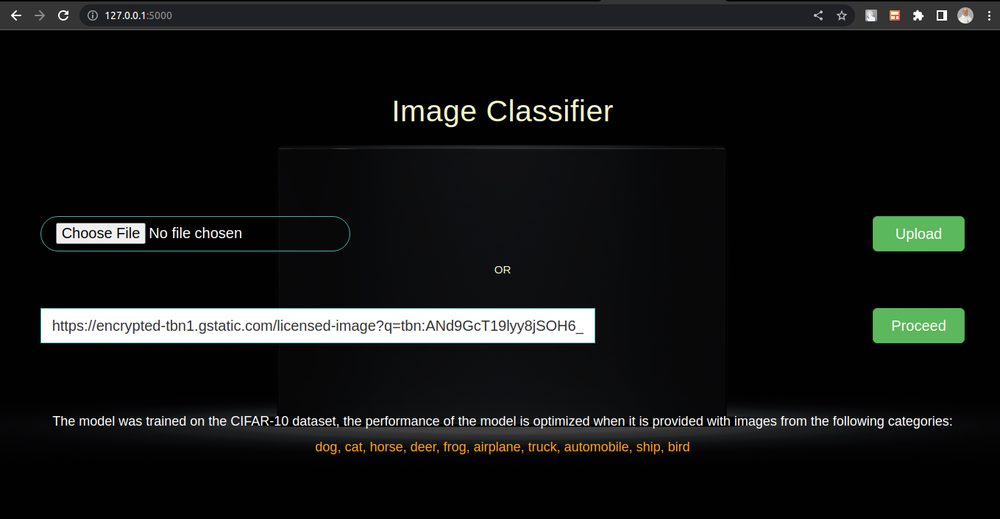
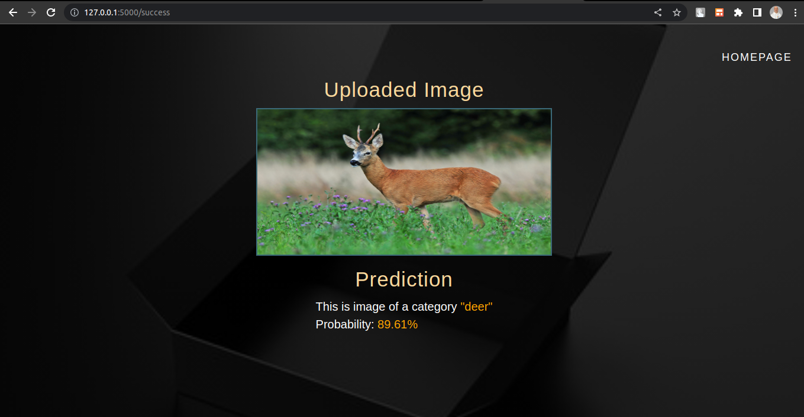
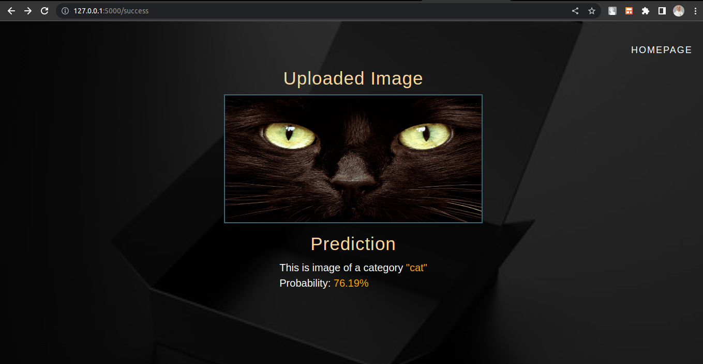
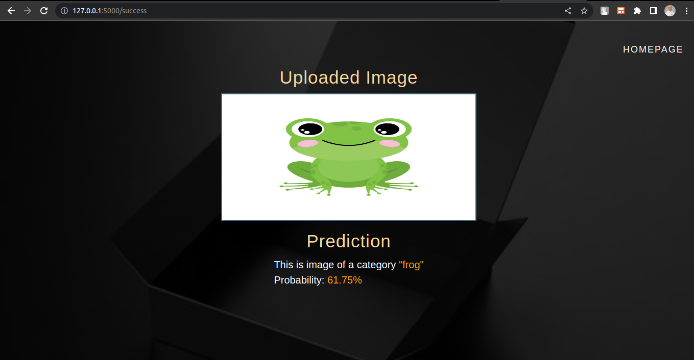

# Classification Web App

This is a web application built with Flask and Keras that allows users to classify images using a pre-trained convolutional neural network model. Users can either upload an image or provide a URL to an image for classification. The app predicts the top class and its probability for the given image.

## Installation

1. Clone the repository:

   ```bash
   git clone https://github.com/SergiiMachulin/classification-web-app.git
   ```

2. Navigate to the project directory:

   ```bash
   cd classification-web-app
   ```

3. Create a virtual environment (optional but recommended):

   ```bash
   python3 -m venv venv
   source venv/bin/activate
   ```

4. Install the required dependencies:

   ```bash
   pip install -r requirements.txt
   ```

5. Download the pre-trained model file (`model.hdf5`) and place it in the project directory.

## Usage

1. Run the Flask web application:

   ```bash
   python app.py
   ```

2. Open a web browser and go to `http://localhost:5000` to access the web app.

3. Upload an image file or provide a URL to an image for classification.

4. Click the corresponding button to initiate the classification process.

5. The app will display the predicted class and its probability for the image.

## Customization

- You can modify the allowed image file extensions by editing the `ALLOWED_EXT` set in the `app.py` file.

- The list of classes used for prediction is defined in the `classes` list in the `app.py` file. You can customize the classes according to your specific classification problem.

- The app uses a pre-trained model (`model.hdf5`) for image classification. If you want to use a different model, replace the existing model file with your own trained model file. Ensure that the model architecture and input size match the requirements of the app.

## Demo







